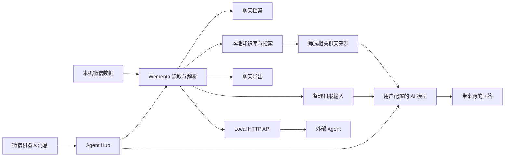

# 微念（Wemento）

<p align="center">
  
</p>

<h2 align="center">把微信聊过的事，找回来、问清楚、留下来</h2>

<p align="center">
  本地优先的微信聊天记录工作台：查看、搜索、提问、总结和导出<br />
  查看聊天 · 找回信息 · AI 问答 · 群聊日报总结 · 语音转写 · 导出 · 微信机器人 · Agent 接入
</p>

<p align="center">
  
  
  
</p>

<p align="center">
  <a href="https://github.com/qiuqiu-2/Wemento/releases"><b>下载微念（Wemento）</b></a>
  ·
  <a href="./docs/user-guide/getting-started.md"><b>第一次使用</b></a>
  ·
  <a href="./docs/README.md"><b>完整文档</b></a>
</p>

<p align="center">
  
</p>

<p align="center">
  
</p>

## 微念（Wemento）是什么

微念（Wemento）是一个本地优先的微信聊天记录搜索、整理与 AI 工作台。它帮助你把散落在聊天里的回忆、约定、资料和想法重新找回来，并以适合长期保存的方式留下来。

“微念”里的“微”来自微信，也代表日常生活中细小但重要的片段；“念”代表记忆、牵挂与思考。英文名 Wemento 将 WeChat 与 memento（纪念、回忆）结合，表达“让微信里的记忆可被重新看见”的愿望。

它可以帮你浏览、搜索和整理微信历史，也可以让 AI 帮你找回聊过的内容，并回到原始消息核对答案。

你可以直接浏览聊天，也可以用自然语言提问：

> “上个月我们讨论过哪些发布问题？”
> “张三之前发过的项目地址在哪里？”
> “技术交流群今天有哪些结论和待办？”

它和普通聊天记录查看器最大的不同，是 AI 不只是告诉你答案，还会告诉你答案来自哪里。你可以看到答案参考了哪些内容、来自哪个会话和时间，再回到原始消息确认它有没有理解错。

> [!NOTE]
> 微念（Wemento）是基于 [WechatExplorer](https://github.com/Wxw-Gu/WechatExplorer) 的个人维护分支与发行版，保留上游项目的核心能力，并维护 Wemento 专属的 Windows 构建、兼容性修复和发布。仓库的 `main` 分支用于同步上游，`personal` 是 Wemento 的稳定集成与发行分支。

## 从你的任务开始

| 我现在想做什么                            | 在应用里打开                                            | 需要准备什么                         |
| ----------------------------------------- | ------------------------------------------------------- | ------------------------------------ |
| 找一句记得原文或关键词的聊天              | [档案](./docs/user-guide/chat-archive.md)               | 连接微信数据，不需要 AI              |
| 找一件记得大意、但不知道在哪聊过的事      | [问问微信](./docs/user-guide/ai-search.md)              | 配置 AI 服务，并选择会话和时间范围   |
| 让长期、跨群聊查找更稳定                  | [问问微信 → 本地知识库](./docs/user-guide/knowledge.md) | 主动建立本地索引；不会自动创建       |
| 快速了解一个群今天、昨天或近 7 天聊了什么 | [日报](./docs/user-guide/report.md)                     | 选择群聊并配置 AI 服务               |
| 把微信语音变成可搜索的文字                | [设置 → 语音转文字](./docs/user-guide/voice.md)         | 准备本地语音模型                     |
| 把聊天保存成 HTML、Markdown、CSV 或 JSON  | [导出](./docs/user-guide/export.md)                     | 选择聊天、时间和格式，不需要 AI      |
| 尽量保留之后捕获到的撤回消息              | [设置 → 防撤回](./docs/user-guide/recall-protection.md) | 默认关闭；开启前先了解写入和性能边界 |
| 直接在微信里向 Wemento 提问               | [微信机器人](./docs/agent/agent-hub.md)                 | 扫码连接机器人；总结类任务需要 AI    |
| 让 Codex 等外部 Agent 查询微信历史        | [外部 Agent](./docs/agent/overview.md)                  | 安装 Reader Skill 并配置本机 Token   |

## 最核心的三个能力

### 浏览和搜索微信历史

- 浏览联系人、群聊、折叠群聊和公众号消息。
- 查看文本、图片、视频、语音、文件、链接、引用、小程序等内容。
- 搜索会话或当前聊天中的关键词。
- 从 AI 结果跳回对应聊天位置。

详细说明：[聊天档案与普通搜索](./docs/user-guide/chat-archive.md)

### AI 帮你找回聊过的内容

打开“问问微信”，选择搜索范围和时间，然后像提问一样描述你想找的内容。

Wemento 会先在本机查找候选消息，再把整理后的少量来源交给你配置的 AI 模型生成回答。你可以查看答案参考了哪些聊天、来自哪个人和时间，并从来源标记跳回原始消息核对；“查看检索详情”还会展示本次查找经历了哪些阶段。

<p align="center">
  
</p>

详细说明：[使用 AI 查找聊天信息](./docs/user-guide/ai-search.md)

### 直接在微信里问你的历史聊天

打开应用中的“Agent”入口（页面标题为“Agent Hub”，对应微信机器人功能），扫码连接一个微信机器人账号。例如，你可以直接给机器人发送“最近 5 个会话”“张三最近和我聊了什么”，或者让它生成指定群聊的总结图片。Wemento 会在本机读取已连接的聊天数据并把结果回复到微信。

这个入口不要求另外安装 Codex、Claude Code 等外部 Agent。当前主要处理文字消息，不支持群发、定时任务或通用自主操作微信；总结和自然语言理解需要先配置 AI 服务。

详细步骤和能力边界见[在微信里向 Wemento 提问](./docs/agent/agent-hub.md)。

## 其他能力

### 本地知识库

“问问微信”里的“本地知识库”会为当前微信账号建立一份留在本机的可检索资料。它把聊天文本、附件信息和已有语音转写整理起来，让跨会话、跨时间查找更稳定。

它只在用户主动建立后工作，可以同步、查看占用并清理；清理不会删除微信原始数据库。

详细说明：[本地知识库](./docs/user-guide/knowledge.md)

### 生成群聊日报

<details>
<summary>查看群聊日报示例、内容和导出方式</summary>

选择群聊和时间范围后，可以让 AI 把聊天整理成报告，并保存为 HTML 与 PNG 长图。报告可能包含热点、重要消息、资源、问答、待办、未解决事项、活跃统计和图片精选；具体内容取决于消息、媒体是否可读以及模型能力。

<p align="center">
  
</p>

详细说明：[生成群聊日报](./docs/user-guide/report.md)

</details>

### 转写微信语音

Wemento 支持在本机转写单条或批量微信语音，结果可以参与本地知识库检索和 HTML 导出。转写本身不要求把语音文件发送给在线 AI；随后用于 AI 问答或日报时，文字会按对应功能的规则处理。

详细说明：[语音转文字](./docs/user-guide/voice.md)

### 防撤回

可选开启后，Wemento 会尽量保留开启期间捕获到的撤回消息。该能力受微信版本和应用运行状态影响，不保证找回所有内容，也不能恢复开启前已经撤回的消息。

详细说明：[防撤回](./docs/user-guide/recall-protection.md)

### 导出长期可用的聊天档案

支持 HTML、CSV、JSON 和 Markdown。HTML 可携带媒体、头像和可选语音转写，支持最多五个会话合并，也可以压缩为 ZIP；增量合并、媒体资源和 ZIP 只适用于 HTML，其他格式主要保留文本内容。

详细说明：[导出聊天](./docs/user-guide/export.md)

### 在外部 Agent 中查询微信历史

通过 Reader Skill 和本机 Local HTTP API，Codex、Claude Code、OpenClaw 等外部 Agent 可以按需查询联系人、群聊和聊天记录。这和微信机器人是两条不同路径：微信机器人收到消息后在微信中回复；外部 Agent 则主动查询历史。

安装和技术说明请看[Agent 接入概览](./docs/agent/overview.md)与[Local HTTP API](./docs/agent/api.md)。

## 它如何工作



- 微信数据库读取、聊天解析、知识库索引和离线语音识别在本机完成。
- 普通浏览、普通搜索和导出不要求配置 AI 服务。
- 使用“问问微信”、群聊日报或图片理解等 AI 功能时，完成任务所需的内容可能发送到你选择的模型服务；具体发送范围和确认方式以对应功能页面为准。
- “问问微信”会先在本机缩小范围，不会默认把整个微信数据库作为一次模型请求发送。

完整边界见：[数据、隐私与安全](./docs/user-guide/privacy.md)

## 支持平台与安装包

| 平台    | 处理器架构                           | Releases 安装包                  |
| ------- | ------------------------------------ | -------------------------------- |
| Windows | x64                                  | `wemento-<版本>-setup.exe`       |
| macOS   | Intel（x64）、Apple Silicon（arm64） | `wemento-<版本>-<架构>.dmg`      |

当前代码面向微信 4.x 数据结构。实际连接结果仍会受到微信客户端版本、账号数据状态和系统权限影响；macOS 首次连接可能需要按页面提示完成额外授权。

## 版本与发布

当前版本为 **v2.1.10**，这是首个以“微念（Wemento）”名称发布的版本。本次发布包含：

- 更新应用、安装器、仓库链接与下载入口的 Wemento 品牌信息；
- 修复部分 Windows 环境下安装器或安装后的程序无法打开的问题；
- 保留 `electron.exe` 兼容名称以满足微信数据库连接组件要求，同时避免安装器误杀其他 Electron 程序。

正式版本从 `personal` 分支构建并发布到 [GitHub Releases](https://github.com/qiuqiu-2/Wemento/releases)。`main` 只作为上游镜像，不用于 Wemento 版本发布。详细变更见 [v2.1.10 发布说明](./docs/release-notes-v2.1.10.md)。

## 快速开始

1. 从 [GitHub Releases](https://github.com/qiuqiu-2/Wemento/releases) 下载安装包。
2. 启动 Wemento，按照“第一次使用”页面选择微信数据目录。
3. 第一次使用请先点击“开始连接”，按页面提示准备连接组件并获取数据库密钥；只有已经有密钥的高级用户才需要“手动连接”。
4. 连接成功后打开“档案”，确认联系人和聊天消息已经出现。
5. 先在“档案”里搜索一句你记得的原话；这一步不需要 AI。
6. 需要 AI 问答或日报时，在“设置 → AI 模型”添加并测试 AI 服务，再打开“问问微信”或“日报”。
7. 想直接在微信里提问时，打开“Agent”扫码连接微信机器人；想让 Codex 等外部 Agent 查询时，再进入“API”。

如果 macOS 页面提示处理 SIP，请先阅读对应说明。具体步骤和限制见[第一次使用](./docs/user-guide/getting-started.md)。

完整步骤：[第一次使用 Wemento](./docs/user-guide/getting-started.md)

## 配置 AI

需要 AI 问答、群聊日报或图片理解时，在“设置 → AI 模型”添加并测试一个服务。应用支持云端服务、Ollama 等本地服务和自定义接口；具体服务商的配置、计费和数据规则由服务商决定。

使用本地服务可以减少数据离开电脑的路径，但本地服务的日志和配置仍由你自己负责。

开发者和 Agent 用户可以从[Agent 接入概览](./docs/agent/overview.md)开始，再按需要查看[Local HTTP API](./docs/agent/api.md)与[API 安全](./docs/agent/api-security.md)。

## 文档

- [文档首页](./docs/README.md)
- [第一次使用](./docs/user-guide/getting-started.md)
- [聊天档案与搜索](./docs/user-guide/chat-archive.md)
- [AI 查找聊天信息](./docs/user-guide/ai-search.md)
- [本地知识库](./docs/user-guide/knowledge.md)
- [群聊日报](./docs/user-guide/report.md)
- [语音转文字](./docs/user-guide/voice.md)
- [导出聊天](./docs/user-guide/export.md)
- [防撤回](./docs/user-guide/recall-protection.md)
- [数据、隐私与安全](./docs/user-guide/privacy.md)
- [Agent 接入](./docs/agent/overview.md)
- [微信机器人与 Agent Hub](./docs/agent/agent-hub.md)
- [Local HTTP API](./docs/agent/api.md)
- [开发与测试](./docs/development/overview.md)

## 本地开发

需要 Node.js、pnpm 7+、对应平台的 Electron/native 构建环境，以及 Go（用于微信连接器）。

```bash
pnpm install
pnpm dev
```

常用检查：

```bash
pnpm typecheck
pnpm test:unit
pnpm test:component
pnpm test:integration
pnpm test:e2e:build
```

完整说明：[开发、测试与构建](./docs/development/overview.md)

## 支持与反馈

遇到问题时，先查看[常见问题与排查](./docs/user-guide/troubleshooting.md)。提交 [Issue](https://github.com/qiuqiu-2/Wemento/issues) 时请提供操作系统、微信版本、Wemento 版本、复现步骤和已遮挡敏感信息的截图。

请仅处理你有权访问的数据，并遵守适用的法律法规、组织政策和微信使用规则。数据库读取、解密、自动化和机器人能力都可能受平台版本与账号环境影响。

## 许可说明

仓库中的第三方组件、模型和连接器遵循各自的许可证。Wemento 基于上游 WechatExplorer 维护；当前仓库根目录未提供独立的项目 `LICENSE` 文件，贡献、复制或再分发前，请先向上游及本仓库维护者确认适用的许可范围。
